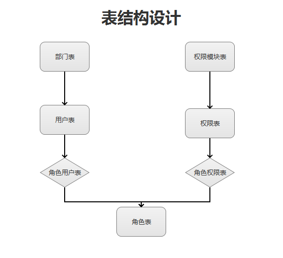

## **自定义权限管理：**
`基于springmvc搭建一套属于自己的权限管理`
`基于RBAC实现，易于扩展，界面管理`
### 开发功能
* 用户模块

`部门列表(树形结构)，增删改查及分页，用户的增删改查与分页，所属部门等`
* 权限模块

`权限列表(树形结构)，增删改查，新增权限(选择上级模块) 权限点的列表(增删改查)
权限点所属的权限模块，类型(菜单、按钮等)，角色列表(管理员、用户等)的增删改查，
角色与权限  角色与用户的关系 权限更新日志的管理等`
* 权限拦截

`在切面(Filter)做权限拦截 确定某用户是否拥有某个权限`
* 辅助类

`redis的封装和使用 | 树形结构的构建 | 权限操作恢复`

### 表结构设计 RBAC模型

**数据库字段见 init.sql**

日志表：是对数据操作状态的更新，及操作日志的记录
### 编码实现
#### springmvc环境搭建:
```
pom.xml:
    <properties>
        <project.build.sourceEncoding>UTF-8</project.build.sourceEncoding>
        <springframework.version>4.3.10.RELEASE</springframework.version>
    </properties>
        <!--spring配置-->
        <dependency>
            <groupId>org.springframework</groupId>
            <artifactId>spring-beans</artifactId>
            <version>${springframework.version}</version>
        </dependency>
        <dependency>
            <groupId>org.springframework</groupId>
            <artifactId>spring-context</artifactId>
            <version>${springframework.version}</version>
        </dependency>
        <!--spring mvc + spring web-->
        <dependency>
            <groupId>org.springframework</groupId>
            <artifactId>spring-web</artifactId>
            <version>${springframework.version}</version>
        </dependency>
        <dependency>
            <groupId>org.springframework</groupId>
            <artifactId>spring-webmvc</artifactId>
            <version>${springframework.version}</version>
        </dependency>
        <dependency>
            <groupId>org.springframework</groupId>
            <artifactId>spring-jdbc</artifactId>
            <version>${springframework.version}</version>
        </dependency>
        <!--mybatis-->
        <dependency>
            <groupId>org.mybatis</groupId>
            <artifactId>mybatis</artifactId>
            <version>3.4.0</version>
        </dependency>
        <dependency>
            <groupId>org.mybatis</groupId>
            <artifactId>mybatis-spring</artifactId>
            <version>1.2.3</version>
        </dependency>
        <!--数据源-->
        <dependency>
            <groupId>com.alibaba</groupId>
            <artifactId>druid</artifactId>
            <version>1.0.20</version>
        </dependency>
        <dependency>
            <groupId>mysql</groupId>
            <artifactId>mysql-connector-java</artifactId>
            <version>5.1.30</version>
        </dependency>
        <!--lombok 注解工具类-->
        <dependency>
            <groupId>org.projectlombok</groupId>
            <artifactId>lombok</artifactId>
            <version>1.16.12</version>
        </dependency>
        <!--jackson guava谷歌封装的工具框架-->
        <dependency>
            <groupId>com.fasterxml.jackson.datatype</groupId>
            <artifactId>jackson-datatype-guava</artifactId>
            <version>2.5.3</version>
        </dependency>
```
web.xml配置：
```
<?xml version="1.0" encoding="UTF-8"?>

<web-app xmlns="http://xmlns.jcp.org/xml/ns/javaee"
         xmlns:xsi="http://www.w3.org/2001/XMLSchema-instance"
         xsi:schemaLocation="http://xmlns.jcp.org/xml/ns/javaee http://xmlns.jcp.org/xml/ns/javaee/web-app_3_1.xsd"
         version="3.1">

  <display-name>Archetype Created Web Application</display-name>
  <!--spring监听器-->
  <listener>
    <listener-class>org.springframework.web.context.ContextLoaderListener</listener-class>
  </listener>
  <!--spring bean配置文件所在的目录-->
  <context-testParam>
    <testParam-name>contextConfigLocation</testParam-name>
    <testParam-value>classpath:applicationContext.xml</testParam-value>
  </context-testParam>
  <!--springmvc 配置 -->
  <servlet>
    <servlet-name>spring</servlet-name>
    <servlet-class>org.springframework.web.servlet.DispatcherServlet</servlet-class>
    <init-testParam>
      <testParam-name>contextConfigLocation</testParam-name>
      <testParam-value>classpath:springServlet.xml</testParam-value>
    </init-testParam>
    <load-on-startup>1</load-on-startup>
  </servlet>
  <servlet-mapping>
    <servlet-name>spring</servlet-name>
    <url-pattern>/</url-pattern>
  </servlet-mapping>
  <!--编码过滤器配置-->
  <filter>
    <filter-name>encodingFilter</filter-name>
    <filter-class>org.springframework.web.filter.CharacterEncodingFilter</filter-class>
    <init-testParam>
      <testParam-name>encoding</testParam-name>
      <testParam-value>UTF-8</testParam-value>
    </init-testParam>
    <init-testParam>
      <testParam-name>forceEncoding</testParam-name>
      <testParam-value>true</testParam-value>
    </init-testParam>
  </filter>
  <filter-mapping>
    <filter-name>encodingFilter</filter-name>
    <url-pattern>/*</url-pattern>
  </filter-mapping>
  <!--欢迎页面-->
  <welcome-file-list>
    <welcome-file>index.jsp</welcome-file>
  </welcome-file-list>
</web-app>
注意:在resources文件夹下新建 springServlet.xml与applicationContext.xml
```
springServlet.xml配置：
```
spring mvc 配置：
    <beans xmlns="http://www.springframework.org/schema/beans"
           xmlns:xsi="http://www.w3.org/2001/XMLSchema-instance"
           xmlns:context="http://www.springframework.org/schema/context"
           xmlns:mvc="http://www.springframework.org/schema/mvc"
    
           xsi:schemaLocation="http://www.springframework.org/schema/beans
           http://www.springframework.org/schema/beans/spring-beans.xsd
           http://www.springframework.org/schema/context
           http://www.springframework.org/schema/context/spring-context.xsd
           http://www.springframework.org/schema/mvc http://www.springframework.org/schema/mvc/spring-mvc.xsd">
    
        <!--上下文相关的注解会被管理-->
        <context:annotation-config></context:annotation-config>
    
        <!--启动注解驱动的springmvc功能-->
        <mvc:annotation-driven/>
    
        <!--启动包扫描功能-->
        <context:component-scan base-package="com.hanxx.permission.controller" />
        <context:component-scan base-package="com.hanxx.permission.service" />
    
        <!--配置bean-->
        <!--获取requestMapping请求的URL和方法-->
        <bean class="org.springframework.web.servlet.mvc.method.annotation.RequestMappingHandlerMapping" />
        <!--返回自定义的视图格式-->
        <bean class="org.springframework.web.servlet.view.BeanNameViewResolver" />
        <!--json返回处理-->
        <bean id="jsonView" class="org.springframework.web.servlet.view.json.MappingJackson2JsonView" />
    
        <!--jsp返回视图解析器-->
        <bean class="org.springframework.web.servlet.view.InternalResourceViewResolver">
            <!--前缀-->
            <property name="prefix" value="/views/" />
            <!--后缀-->
            <property name="suffix" value=".jsp" />
        </bean>
    
    </beans>
```
applicationContext.xml配置：
```
 <!--spring相关的配置-->
    <!--获取外界配置文件-->
    <bean id="placeholderConfigurer" class="org.springframework.beans.factory.config.PropertyPlaceholderConfigurer">
        <property name="ignoreUnresolvablePlaceholders" value="true" />
        <property name="locations">
            <list>
                <value>classpath:db.properties</value>
            </list>
        </property>
    </bean>

    <!--数据源的配置-->
    <bean id="dataSource" class="com.alibaba.druid.pool.DruidDataSource" init-method="init" destroy-method="close">
        <property name="driverClassName" value="${db.driverClassName}"/>
        <property name="url" value="${db.url}" />
        <property name="username" value="${db.username}" />
        <property name="password" value="${db.password}" />
        <!--初始化链接-->
        <property name="initialSize" value="3"/>
        <!--最小空余的连接数-->
        <property name="minIdle" value="3"/>
        <!--最大的连接池数-->
        <property name="maxActive" value="20" />
        <!--最大等待时间-->
        <property name="maxWait" value="60000" />
        <!--属性类型是字符串，通过别名的方式配置扩展插件，-->
        <!--常用的插件有：-->
        <!--监控统计用的filter:stat-->
        <!--日志用的filter:log4j-->
        <!--防御sql注入的filter:wall-->
        <property name="filters" value="stat,wall" />
    </bean>

    <!--sqlSessionFactory 整个mybatis-->
    <bean id="sqlSessionFactory" class="org.mybatis.spring.SqlSessionFactoryBean">
        <property name="configLocation" value="classpath:mybatisConfig.xml"/>
        <property name="dataSource" ref="dataSource" />
        <property name="mapperLocations" value="classpath:mapper/*.xml" />
    </bean>
    <!--mapper扫描-->
    <bean class="org.mybatis.spring.mapper.MapperScannerConfigurer">
        <property name="basePackage" value="com.hanxx.permission.dao"/>
        <property name="sqlSessionFactoryBeanName" value="sqlSessionFactory" />
    </bean>
    <!--声明式事务-->
    <bean id="transactionManager" class="org.springframework.jdbc.datasource.DataSourceTransactionManager">
        <property name="dataSource" ref="dataSource" />
    </bean>

    <tx:annotation-driven transaction-manager="transactionManager" />

    <!--druid配置-->
    <bean id="stat-filter" class="com.alibaba.druid.filter.stat.StatFilter">
        <property name="slowSqlMillis" value="3000" />
        <property name="logSlowSql" value="true" />
        <property name="mergeSql" value="true" />
    </bean>
    <bean id="wall-filter" class="com.alibaba.druid.wall.WallFilter">
        <property name="dbType" value="mysql"/>
    </bean>
```
配置druid监控：
```
web.xml:
<!--druid的访问-->
  <servlet>
    <servlet-name>DruidSevlet</servlet-name>
    <servlet-class>com.alibaba.druid.support.http.StatViewServlet</servlet-class>
    <!--登录名密码-->
    <init-testParam>
      <testParam-name>loginUsername</testParam-name>
      <testParam-value>druid</testParam-value>
    </init-testParam>
    <init-testParam>
      <testParam-name>loginPassword</testParam-name>
      <testParam-value>druid</testParam-value>
    </init-testParam>
  </servlet>
  <servlet-mapping>
    <servlet-name>DruidSevlet</servlet-name>
    <url-pattern>/sys/druid/*</url-pattern>
  </servlet-mapping>
  <!--druid的拦截请求-->
  <filter>
    <filter-name>DruidFilter</filter-name>
    <filter-class>com.alibaba.druid.support.http.WebStatFilter</filter-class>
    <!--过滤掉的拦截参数-->
    <init-testParam>
      <testParam-name>exclusions</testParam-name>
      <testParam-value>*.js,*.css,*.png,*.ico,*.gif,/sys/druid/*</testParam-value>
    </init-testParam>
  </filter>
  <filter-mapping>
    <filter-name>DruidFilter</filter-name>
    <url-pattern>/*</url-pattern>
  </filter-mapping>
```
mybatis config 配置：
```
<?xml version="1.0" encoding="UTF-8" ?>
<!DOCTYPE configuration PUBLIC "-//mybatis.org//DTD Config 3.0//EN"
        "http://mybatis.org/dtd/mybatis-3-config.dtd">
<configuration>

    <settings>
        <setting name="safeRowBoundsEnabled" value="true"/>
        <!--不允许缓存sql-->
        <setting name="cacheEnabled" value="false"/>
        <!--生成主键策略-->
        <setting name="useGeneratedKeys" value="true" />
    </settings>
    <!--<typeAliases>-->
        <!---->
    <!--</typeAliases>-->
    <!--<plugins>-->
        <!--<plugin interceptor=""></plugin>-->
    <!--</plugins>-->
</configuration> 
```
配置logback：
```
依赖：
        <!--logback-->
        <dependency>
            <groupId>ch.qos.logback</groupId>
            <artifactId>logback-core</artifactId>
            <version>1.1.8</version>
        </dependency>
        <dependency>
            <groupId>ch.qos.logback</groupId>
            <artifactId>logback-classic</artifactId>
            <version>1.1.8</version>
        </dependency>
        <dependency>
            <groupId>org.slf4j</groupId>
            <artifactId>slf4j-api</artifactId>
            <version>1.7.22</version>
        </dependency>
配置：logback.xml:
<?xml version="1.0" encoding="UTF-8" ?>
<configuration scan="true" scanPeriod="60 seconds">
    <appender name="STDOUT" class="ch.qos.logback.core.ConsoleAppender">
        <!--标准输出日志格式-->
        <encoder>
            <!--日期 进程 级别 日志名称 日志内容 换行-->
            <pattern>%d{yyyy-MM-dd HH:mm:ss.SSS} [%thread] %-5level %logger - %msg%n</pattern>
        </encoder>
    </appender>

    <!--&lt;!&ndash;根据设置对日志进行压缩 输出 归档等&ndash;&gt;-->
    <!--<appender name="permission" class="ch.qos.logback.core.rolling.RollingFileAppender">-->
        <!--&lt;!&ndash;位置&ndash;&gt;-->
        <!--<file>${catalina.home}/logs/permission.log</file>-->
        <!--&lt;!&ndash;压缩规则&ndash;&gt;-->
        <!--<rollingPolicy class="ch.qos.logback.core.rolling.TimeBasedRollingPolicy">-->
            <!--<FileNamePattern>${catalina.home}/logs/permission.%d{yyyy-MM-dd-HH}.log.gz</FileNamePattern>-->
        <!--</rollingPolicy>-->
        <!--&lt;!&ndash;日志输出格式&ndash;&gt;-->
        <!--<layout class="ch.qos.logback.classic.PatternLayout">-->
            <!--<pattern>-->
                <!--%d{yyyy-MM-dd HH:mm:ss.SSS} [%thread] %-5level %logger - %msg%n-->
            <!--</pattern>-->

        <!--</layout>-->
    <!--</appender>-->
    <!--&lt;!&ndash;使用自定义的appender&ndash;&gt;-->
    <!--<logger name="xxx" level="INFO">-->
        <!--<appender-ref ref="permission"/>-->
    <!--</logger>-->

    <!--trace < debug <info < warn <error-->
    <root level="INFO">
        <appender-ref ref="STDOUT"></appender-ref>
    </root>
</configuration>  
```
开发环境验证：
```
如果IDEA使用 @Slf4j 找不到 log.
安装插件 Lombok Plugin
否则：
    // Slf4j .Logger 日志
    private final Logger logger = LoggerFactory.getLogger(TestController.class);

@Controller
@RequestMapping("/test")
@Slf4j
public class TestController {

    @RequestMapping("/hello")
    @ResponseBody
    public String hello(){
        log.info("Hello permission manager !!! ");
        return JsonData.success("Hello, permission");
    }
}
```
#### 工具类的开发：
```text
mybatis generate使用生成核心类：
导入核心jar , mysql驱动 与 配置文件 运行如下命令
java -jar mybatis-generator-core-1.3.2.jar -configfile generator.xml

项目接口定义-json:
common包下
@Getter
@Setter
public class JsonData {

    // 返回结果
    private boolean ret;

    // 出现异常返回消息
    private String msg;

    //返回数据
    private Object data;

    /**
     * 只返回是否成功的构造方法
     * @testParam ret
     */
    public  JsonData (boolean ret){
        this.ret=ret;
    }

    /**
     * 成功的时候不返回任何数据
     * @return
     */
    public  static JsonData success(){
        //成功
        return  new JsonData(true);
    }
    
    /**
     * 成功的时候返回 数据 与 消息
     * @testParam o
     * @testParam msg
     * @return
     */
    public  static JsonData success(Object o, String msg){
        //成功
        JsonData jsonData = new JsonData(true);
        jsonData.data = o;
        jsonData.msg = msg;
        return jsonData;
    }

    /**
     * 成功时只返回数据
     * @testParam o
     * @return
     */
    public  static JsonData success(Object o){
        //成功
        JsonData jsonData = new JsonData(true);
        jsonData.data = o;
        return jsonData;
    }
    
    /**
     * 失败时只返回异常消息
     * @testParam msg
     * @return
     */
    public static JsonData fail(String msg){
        // 失败
        JsonData jsonData = new JsonData(false);
        jsonData.msg = msg;
        return jsonData;
    }
      /**
         * 把数据转换成map类型 供 modelandview返回
         * @return
         */
        public Map<String, Object> toMap(){
            HashMap<String, Object> map = new HashMap<>();
            map.put("ret",ret);
            map.put("msg",msg);
            map.put("data",data);
            return map;
        }
}
全局异常的处理类：
导入pom.xml
 <!--jsp -api 封装异常处理需要的request与response-->
        <!-- https://mvnrepository.com/artifact/org.apache.tomcat/jsp-api -->
        <dependency>
            <groupId>org.apache.tomcat</groupId>
            <artifactId>jsp-api</artifactId>
            <version>6.0.36</version>
        </dependency>
  自定义异常：
  /**
   * @Author hanxx
   * @Date 2018/4/19-16:42
   * 自定义异常
   */
  public class PermissionException extends RuntimeException{
      public PermissionException() {
          super();
      }
  
      public PermissionException(String message) {
          super(message);
      }
  
      public PermissionException(String message, Throwable cause) {
          super(message, cause);
      }
  
      public PermissionException(Throwable cause) {
          super(cause);
      }
  
      protected PermissionException(String message, Throwable cause, boolean enableSuppression, boolean writableStackTrace) {
          super(message, cause, enableSuppression, writableStackTrace);
      }
  }
自定义异常的处理方法： 在这里规定：凡事json请求在RequestMapping中加上.json 页面请求加上.page
/**
 * @Author hanxx
 * @Date 2018/4/19-16:35
 * 异常处理类
 */
@Slf4j
public class SpringException implements HandlerExceptionResolver{
    @Override
    public ModelAndView resolveException(HttpServletRequest request, HttpServletResponse response, Object o, Exception e) {
       String url = request.getRequestURL().toString();  //获取请求url
        ModelAndView mv;    //视图
        String errorDefault = "系统异常";

        // .json 请求  .page页面请求
        if(url.endsWith(".json")){  //.json结尾为json请求
            //如果属于我们自定义的异常
            if (e instanceof PermissionException){
                JsonData result = JsonData.fail(e.getMessage());
                //返回视图为map类型的json springMvc配置文件中定义为 jsonView
                mv = new ModelAndView("jsonView",result.toMap());
            } else {
                log.error("未知json异常 ,URL:"+url , e); //记录异常日志
                JsonData result = JsonData.fail(errorDefault);
                mv = new ModelAndView("jsonView",result.toMap());
            }
        }else if (url.endsWith(".page")) {     //页面返回
            log.error("未知page异常,URL:"+url , e); //记录异常日志
            JsonData result = JsonData.fail(errorDefault);
            // 页面会获取 View 中的exception页面处理
            mv = new ModelAndView("exception",result.toMap());
        }else {
            JsonData result = JsonData.fail(errorDefault);
            mv = new ModelAndView("jsonView",result.toMap());
        }
        return mv;
    }
}
说明:  mv = new ModelAndView("jsonView",result.toMap()); 
<bean id="jsonView" class="org.springframework.web.servlet.view.json.MappingJackson2JsonView" />
其中 jsonView与配置中的id名一样

mv = new ModelAndView("exception",result.toMap()); 
exception为页面请求异常，需要创建exception.jsp使用

把异常处理注册到springBean中：
 <!--自定义异常处理类-->
 <bean class="com.hanxx.permission.common.SpringExceptionHandler"/>
测试：
/**
 * 测试开发环境
 */
@Controller
@RequestMapping("/test")
@Slf4j
public class TestController {
    @RequestMapping("/hello.json")  //返回json请求规定加上.json
    @ResponseBody
    public JsonData hello(){
        log.info("Hello permission manager !!! ");
        throw new PermissionException("我是自定义异常");
        //return JsonData.success("Hello, very good");
    }
}
校验工具 validation：
引入依赖：
  <!--校验工具类-->
        <!-- https://mvnrepository.com/artifact/javax.validation/validation-api -->
        <dependency>
            <groupId>javax.validation</groupId>
            <artifactId>validation-api</artifactId>
            <version>1.1.0.Final</version>
        </dependency>
        <!-- https://mvnrepository.com/artifact/org.hibernate/hibernate-validator -->
        <dependency>
            <groupId>org.hibernate</groupId>
            <artifactId>hibernate-validator</artifactId>
            <version>5.2.4.Final</version>
        </dependency>
     自定义校验：
     /**
      * @Author hanxx
      * @Date 2018/4/19-17:17
      * 自定义校验工具
      */
     public class BeanValidation {
     
         //创建校验工厂
         private static ValidatorFactory validatorFactory = Validation.buildDefaultValidatorFactory();
     
         /**
          * 单个校验
          * @testParam t
          * @testParam groups
          * @testParam <T>
          * @return
          */
         public static <T>Map<String, String> validate(T t,Class... groups){
             Validator validator =validatorFactory.getValidator();
             Set result = validator.validate(t, groups);
             if(result.isEmpty()){
                 return Collections.emptyMap();
             }else {
                 //发成错误放入 errors
                 LinkedHashMap errors = Maps.newLinkedHashMap();
                 // 遍历错误
                 Iterator iterator = result.iterator();
                 while (iterator.hasNext()){
                     ConstraintViolation violation = (ConstraintViolation) iterator.next();
                     //错误字段 与错误信息
                     errors.put(violation.getPropertyPath().toString(),violation.getMessage());
                 }
                 return errors;
             }
         }
     
         /**
          * 多个校验
          * @testParam collection
          * @return
          */
         public static Map<String, String> validateList(Collection<?> collection){
             Preconditions.checkNotNull(collection);
             Iterator iterator = collection.iterator();
             Map errors;
             do{
                 if (! iterator.hasNext()){
                     return Collections.emptyMap();
                 }
                 Object object =iterator.next();
                 errors=validate(object, new Class[0]);
             }while (errors.isEmpty());
             return errors;
         }
     
         /**
          * 封装单个校验与多个校验
          * @testParam first
          * @testParam objects
          * @return
          */
         public static Map<String, String> validateObject(Object first, Object...objects){
             if (objects !=null && objects.length>0 ){
                 return validateList(Lists.asList(first,objects));
             }else {
                 return validate(first,new Class[0]);
             }
         }
         
     
     }
     单元测试：
     /**
      * 校验测试  model
      * @Author hanxx
      * @Date 2018/4/19-17:36
      */
     @Getter
     @Setter
     public class Param {
     
         @NotBlank
         private String msg;
         @NotNull
         private Integer id;
     }
    controller:
   @RequestMapping("/validate.json")  //返回json请求规定加上.json
    @ResponseBody
    public JsonData validate(Param testParam){
        log.info("Hello validate!!! ");
        try {
            Map<String,String> map = BeanValidation.validateObject(testParam);
            if (map !=null && map.entrySet().size() > 0){
                for (Map.Entry<String,String> entry : map.entrySet()){
                    log.info("{}--{}",entry.getKey(),entry.getValue());
                }
            }
        } catch (Exception e){
        }

        return JsonData.success("Hello, validate");
    }
        
```
自定义验证异常： 由于经常要用到判断map是否为空 所以可以引用MapUtils工具包
```
工具包：
<dependency>
            <groupId>commons-collections</groupId>
            <artifactId>commons-collections</artifactId>
            <version>3.2.2</version>
        </dependency>
        <!-- https://mvnrepository.com/artifact/commons-codec/commons-codec -->
        <dependency>
            <groupId>commons-codec</groupId>
            <artifactId>commons-codec</artifactId>
            <version>1.10</version>
        </dependency>
新建验证异常：
/**
 * @Author hanxx
 * @Date 2018/4/19-16:42
 * 自定义验证异常
 */
public class PermissionException extends RuntimeException{
    public PermissionException() {
        super();
    }

    public PermissionException(String message) {
        super(message);
    }

    public PermissionException(String message, Throwable cause) {
        super(message, cause);
    }

    public PermissionException(Throwable cause) {
        super(cause);
    }

    protected PermissionException(String message, Throwable cause, boolean enableSuppression, boolean writableStackTrace) {
        super(message, cause, enableSuppression, writableStackTrace);
    }
}
在全局异常添加对验证异常的处理：
        // .json 请求  .page页面请求
        if(url.endsWith(".json")){  //.json结尾为json请求
            //如果属于我们自定义的异常
            if (e instanceof PermissionException || e instanceof ParamValidateException){
                JsonData result = JsonData.fail(e.getMessage());
                //返回视图为map类型的json springMvc配置文件中定义为 jsonView
                mv = new ModelAndView("jsonView",result.toMap());
            } else {
                log.error("未知json异常 ,URL:"+url , e); //记录异常日志
                JsonData result = JsonData.fail(errorDefault);
                mv = new ModelAndView("jsonView",result.toMap());
            }
        }else if (url.endsWith(".page")) {     //页面返回
            log.error("未知page异常,URL:"+url , e); //记录异常日志
            JsonData result = JsonData.fail(errorDefault);
            // 页面会获取 View 中的exception页面处理
            mv = new ModelAndView("exception",result.toMap());
        }else {
            JsonData result = JsonData.fail(errorDefault);
            mv = new ModelAndView("jsonView",result.toMap());
        }
在自定义验证方法中添加验证并对验证是否通过的方法：
    /**
     * 验证如果不通过抛出自定义验证异常
     * @testParam object
     * @throws ParamValidateException
     */
    public static void validateException(Object object) throws ParamValidateException{
        Map<String,String> map = BeanValidation.validateObject(object);
        if(MapUtils.isNotEmpty(map)){
            throw  new ParamValidateException(map.toString());
        }
    }
    验证使用：
    model:
    @Getter
    @Setter
    public class Param {
    
        @NotBlank(message = "msg不能为空")
        private String msg;
        @NotNull(message = "id不能为空")
        private Integer id;
    }
    controller:
     @RequestMapping("/validate.json")  //返回json请求规定加上.json
        @ResponseBody
        public JsonData validate(Param testParam){
            log.info("Hello validate!!! ");
            /*try {
                Map<String,String> map = BeanValidation.validateObject(testParam);
                if (MapUtils.isNotEmpty(map)){
                    for (Map.Entry<String,String> entry : map.entrySet()){
                        log.info("{}--{}",entry.getKey(),entry.getValue());
                    }
                }
            } catch (Exception e){
            }*/
            // 使用验证异常
            BeanValidation.validateException(testParam);
    
            return JsonData.success("Hello, validate");
        }
```
json转换工具：
```
依赖：
 <!--jackson-->
        <!-- https://mvnrepository.com/artifact/org.codehaus.jackson/jackson-core-asl -->
        <dependency>
            <groupId>org.codehaus.jackson</groupId>
            <artifactId>jackson-core-asl</artifactId>
            <version>1.9.13</version>
        </dependency>

        <!-- https://mvnrepository.com/artifact/org.codehaus.jackson/jackson-mapper-asl -->
        <dependency>
            <groupId>org.codehaus.jackson</groupId>
            <artifactId>jackson-mapper-asl</artifactId>
            <version>1.9.13</version>
        </dependency>
 编程：
 /**
  * Author:hangx
  * Date: 2018/4/19 21:22
  * DESC: json转化工具
  */
 @Slf4j
 public class JsonMapper {
 
     private static ObjectMapper objectMapper = new ObjectMapper();
 
     //初始化配置
     static {
         //config
         objectMapper.disable(DeserializationConfig.Feature.FAIL_ON_NULL_FOR_PRIMITIVES);
         objectMapper.configure(SerializationConfig.Feature.FAIL_ON_EMPTY_BEANS,false);
         objectMapper.setFilters(new SimpleFilterProvider().setFailOnUnknownId(false));
         objectMapper.setSerializationInclusion(JsonSerialize.Inclusion.NON_EMPTY);
     }
 
     // 对象转换为字符串
     public static <T> String objString(T src){
         if (src == null){
             return null;
         }
         try {
             return src instanceof String ? (String) src : objectMapper.writeValueAsString(src);
         } catch (Exception e){
             log.warn("object 转换 string 出错：",e);
             return null;
         }
     }
 
     //字符串转对象
     public static <T> T stringObj(String str, TypeReference<T> type){
         if (str == null || type == null){
             return null;
         }
         try {
             return (T) (type.getType().equals(String.class) ? str : objectMapper.readValue(str,type));
         }catch (Exception e){
             log.warn("string 转换 object 出错。String:{},type:{},error:{}",str,type.getType(),e.getMessage());
             return null;
         }
     }
 }
```
spring上下文工具：applicationContextHelper
```
/**
 * Author:hangx
 * Date: 2018/4/19 21:45
 * DESC: spring上下文工具
 */
@Component("applicationContextHelper")  //spring管理
public class ApplicationContextHelper implements ApplicationContextAware{

    private static ApplicationContext applicationContext;   //全局的 applicationContext

    @Override
    public void setApplicationContext(ApplicationContext context) throws BeansException {
        applicationContext = context;
    }

    /**
     * 从springbean 上下文中取 class
     * @testParam clazz
     * @testParam <T>
     * @return
     */
    public static <T> T popBean(Class<T> clazz){
        if (applicationContext == null ){
            return null;
        }
        return applicationContext.getBean(clazz);
    }

    /**
     * 从springbean取出 名字 和 class
     * @testParam name
     * @testParam clazz
     * @testParam <T>
     * @return
     */
    public static <T> T popBean(String name,Class<T> clazz){
        if (applicationContext == null ){
            return null;
        }
        return applicationContext.getBean(name, clazz);
    }

}

添加到spring-service配置文件中:
    <!--spring上下文工具类-->
    <bean class="com.hanxx.permission.common.ApplicationContextHelper" lazy-init="false" />
单元测试：注意：mybatis-spring jar 依赖需要调整到 1.3.0
<dependency>
            <groupId>org.mybatis</groupId>
            <artifactId>mybatis-spring</artifactId>
            <version>1.3.0</version>
</dependency>
测试：
 /**
     * 验证spring自定义上下文与Json类型工具的转换
     * @return
     */
    @RequestMapping("/application.json")  //返回json请求规定加上.json
    @ResponseBody
    public JsonData application(Param testParam){
        log.info("Hello permission manager !!! ");
        SysAclModuleMapper moduleMapper = ApplicationContextHelper.popBean(SysAclModuleMapper.class);
        SysAclModule module = moduleMapper.selectByPrimaryKey(1);
        log.info(JsonMapper.objString(module));
        BeanValidation.validateException(testParam);
        return JsonData.success("spring上下文与json转换类型成功！");
    }
        
```
HTTP请求前后的监听实现：interceptor
```text
/**
 * Author:hangx
 * Date: 2018/4/19 22:09
 * DESC: http请求监听的工具类
 */
@Slf4j
public class HttpInterceptor extends HandlerInterceptorAdapter {
    /**
     * 请求处理之前
     * @testParam request
     * @testParam response
     * @testParam handler
     * @return
     * @throws Exception
     */
    @Override
    public boolean preHandle(HttpServletRequest request, HttpServletResponse response, Object handler) throws Exception {
        String url = request.getRequestURI().toString();    //请求地址
        Map map =request.getParameterMap();                 //请求参数
        log.info("请求开始之前==》》url:{},params:{}",url, JsonMapper.objString(map));
        return true;
    }

    /**
     * 请求正常结束之后
     * @testParam request
     * @testParam response
     * @testParam handler
     * @testParam modelAndView
     * @throws Exception
     */
    @Override
    public void postHandle(HttpServletRequest request, HttpServletResponse response, Object handler, ModelAndView modelAndView) throws Exception {
        String url = request.getRequestURI().toString();    //请求地址
        Map map =request.getParameterMap();                 //请求参数
        log.info("请求正常结束后==》》url:{},params:{}",url, JsonMapper.objString(map));

    }

    /**
     * 正常、异常请求结束都会调用
     * @testParam request
     * @testParam response
     * @testParam handler
     * @testParam ex
     * @throws Exception
     */
    @Override
    public void afterCompletion(HttpServletRequest request, HttpServletResponse response, Object handler, Exception ex) throws Exception {
        String url = request.getRequestURI().toString();    //请求地址
        Map map =request.getParameterMap();                 //请求参数
        log.info("请求结束后==》》url:{},params:{}",url, JsonMapper.objString(map));

    }
}

配置到springservlet配置文件中：
 <!--配置监听-->
    <mvc:interceptors>
        <bean class="com.hanxx.permission.common.HttpInterceptor" />
    </mvc:interceptors>

```
### 实际功能的实现：
##### 部门模块的开发：
部门新增模块：
```text
//1. 部门层级结构的树形书工具类
/**
 * @Author hanxx
 * @Date 2018/4/20-10:37
 * Level 工具类
 */
public class LevelUtil {
    // 层级的分隔符
    public final static String SEPARATOR=".";
    // level的层数开始
    public final static String ROOT="0";

    /**
     * 层级的计算规则
     * 首层：0
     * 二层：0.1       0.2
     * 三层：0.1.1     0.2.1
     * @param parentLevel
     * @param parentId
     * @return
     */
    public static String calLevel(String parentLevel, int parentId){
            // 引入apache-commons-lang3工具类
            if(StringUtils.isBlank(parentLevel)) {  //判断是否为首层
                return ROOT;
            }else {
                return StringUtils.join(parentLevel,SEPARATOR,parentId);
            }
    }
}
//2. 对原型添加 @build注解：
@Builder    //包装为一个构建者模式，编译时增加了一个Builder内部类和全字段的构造器
@NoArgsConstructor  //不需要参数的构造方法
@AllArgsConstructor //所有参数的构造方法
@ToString   //tostring
public class SysDept {
}
//3.新建需要添加的字段：
@Getter
@Setter
@ToString
public class DeptParam {

    private Integer id;  //id

    @NotBlank(message = "部门名称不能为空")
    @Length(max = 15, min = 2, message = "部门名称需要在2-15个字之间")
    private String name;    //部门名称

    private  Integer parentId;  //上级部门ID

    @NotNull(message = "排序权重不能为空")
    private Integer seq;    //排序

    @Length(max = 150, message = "备注的长度不能超过150个字")
    private String remark;  //备注
}
//4 .新增service的视线：
public interface DeptService {

    /**
     *  验证添加或修改部门的名称是否存在
     * @param parentId      父级部门ID
     * @param paramName  部门名称
     * @param paramId       部门ID
     * @return
     */
    boolean check(Integer parentId,String paramName,Integer paramId);

    /**
     *  获取当前部门层级
     * @param deptId
     * @return
     */
    String getLevel(Integer deptId);

    /**
     * 保存新添加的部门
     * @param param
     */
    void save(DeptParam param);
}
    //实现类的实现
    //传入dept的 mapper
    @Resource
    private SysDeptMapper deptMapper;

    @Override
    public boolean check(Integer parentId, String paramName, Integer paramId) {
        // TODO:
        return true;
    }

    @Override
    public String getLevel(Integer deptId) {
        SysDept dept = deptMapper.selectByPrimaryKey(deptId);
        if (dept == null){
            return null;
        }
        return dept.getLevel(); //返回上一层部门的level
    }

    /**
     * 保存部门类
     * @param param
     */
    @Override
    public void save(DeptParam param) {
        //验证参数
        BeanValidation.validateException(param);
        //验证部门是否已存在
        if (check(param.getParentId(),param.getName(),param.getId())){
            throw new ParamValidateException("同一层级下部门名称已存在");
        }
        SysDept dept =SysDept.builder().name(param.getName()).parentId(param.getParentId())
                .seq(param.getSeq()).remark(param.getRemark()).build();
        // 计算部门层级
        dept.setLevel(LevelUtil.calLevel(getLevel(param.getParentId()),param.getParentId()));

        dept.setOperator("system"); //TODO
        dept.setOperator("127.0.0.1"); //TODO
        dept.setOperateTime(new Date());
        deptMapper.insertSelective(dept);
    }
```
树的层级结构：
```text
//首先要获取部门树级结构要定义树结构的类型：
@Getter
@Setter
@ToString
public class DeptLevelDto extends SysDept{

    // 用来接收传入的树形结构层次
    private List<DeptLevelDto> deptList = Lists.newArrayList();

    public static DeptLevelDto newTrue(SysDept dept){
        DeptLevelDto dto = new DeptLevelDto();
        //把dept接收的数据拷贝到 dto
        BeanUtils.copyProperties(dept,dto);
        return dto;
    }
}
//获取全部的部门比较部门的层级
List<SysDept> getAll();
/**
    <select id="getAll" resultMap="BaseResultMap">
    select
    <include refid="Base_Column_List" />
    from sys_dept
  </select>
  */
 // 获取树形的列表,并遍历进行排序：
  /**
   * @Author hanxx
   * @Date 2018/4/20-16:15
   * 树形结构的服务类
   */
  @Service
  public class SysTreeServiceImpl implements SysTreeService{
  
      @Autowired
      private SysDeptMapper deptMapper;
  
      @Override
      public List<DeptLevelDto> deptTree() {
          List<SysDept> list = deptMapper.getAll();
  
          List<DeptLevelDto> dtoList = Lists.newArrayList();
          for (SysDept dept : list) {
              DeptLevelDto dto = DeptLevelDto.newTrue(dept);
              dtoList.add(dto);
          }
          return toTree(dtoList);
      }
  
      /**
       * 转换成树形结构
       * @param list
       * @return
       */
      public List<DeptLevelDto> toTree(List<DeptLevelDto> list){
          if (CollectionUtils.isEmpty(list)){
              return Lists.newArrayList();
          }
          // map类型{key：[dept1],[dept2]}
          Multimap<String,DeptLevelDto> multimap = ArrayListMultimap.create();
          List<DeptLevelDto> depts = Lists.newArrayList();
  
          for (DeptLevelDto dto : list){
              multimap.put(dto.getLevel(),dto);
              // 如果是顶级目录
              if (LevelUtil.ROOT.equals(dto.getLevel())){
                  depts.add(dto);
              }
          }
          // 按照 seq 从小到大排序
          Collections.sort(depts, new Comparator<DeptLevelDto>() {
              @Override
              public int compare(DeptLevelDto o1, DeptLevelDto o2) {
                  return o1.getSeq() - o2.getSeq();
              }
          });
          // 递归
          transformDeptTree(depts, LevelUtil.ROOT, multimap);
          return depts;
      }
      //递归排序：
      public void transformDeptTree(List<DeptLevelDto> dtos,String level,Multimap<String,DeptLevelDto> multimap){
          for (int i = 0; i<dtos.size();i++){
              //遍历每个元素
              DeptLevelDto dto =dtos.get(i);
              //处理当前的层级
              String nextLevel = LevelUtil.calLevel(level,dto.getId());
              // 处理下一层
              List<DeptLevelDto> temp = (List<DeptLevelDto>) multimap.get(nextLevel);
              if (CollectionUtils.isNotEmpty(temp)){
                  // 排序
                  Collections .sort(temp, deptLevelComparator);
                  // 设置下一层部门
                  dto.setDeptList(temp);
                  // 进入下层处理
                  transformDeptTree(temp,nextLevel,multimap);
              }
          }
      }
  
      public Comparator<DeptLevelDto> deptLevelComparator = new Comparator<DeptLevelDto>() {
          @Override
          public int compare(DeptLevelDto o1, DeptLevelDto o2) {
              return o1.getSeq() - o2.getSeq();
          }
      };
  }
  //获取树形的controller
   @RequestMapping("/tree.json")
      @ResponseBody
      public JsonData tree(){
          //获取列表
          List<DeptLevelDto> dtoList =treeService.deptTree();
  
          return JsonData.success(dtoList);
      }
```
更新部门接口开发：
```text
/**
* 更新设计到 获取部门树 批量更新部门树, 判断更新的部门是否已经存在
*/
//mapper设计：
 List<SysDept> getChildDeptListByLevel(@Param("level") String level);

    /**
     * 批量更新level
     */
    void batchUpdateLevel(@Param("depts") List<SysDept> depts);

    int countByNameAndParentId(@Param("parentId") int parentId,@Param("deptName") String deptName,@Param("id") Integer id);
<select id="getChildDeptListByLevel" resultMap="BaseResultMap">
    select
    <include refid="Base_Column_List" />
    from sys_dept
    WHERE level LIKE #{level} || '.%'
  </select>

  <update id="batchUpdateLevel" parameterType="map">
    <foreach collection="depts" item="sysDept" separator=";">
      UPDATE sys_dept
      SET level = #{dept.level}
      WHERE id = #{dept.id}
    </foreach>
  </update>
  
  <select id="countByNameAndParentId" parameterType="map" resultType="int">
    SELECT count(1)
    FROM sys_dept
    WHERE parent_id = #{parentId}
    AND name = #{deptName}
    <if test="id != null">
      AND id != #{id}
    </if>
  </select>
  更新方法：
   @Override
      public void update(DeptParam param) {
          BeanValidation.validateException(param);
          //验证部门是否已存在
          if (check(param.getParentId(),param.getName(),param.getId())){
              throw new ParamValidateException("同一层级下部门名称已存在");
          }
          SysDept before = deptMapper.selectByPrimaryKey(param.getId());
          Preconditions.checkNotNull(before,"您要更新的部门不存在！");
          if (check(param.getParentId(),param.getName(),param.getId())){
              throw new ParamValidateException("同一层级下部门名称已存在");
          }
          SysDept after = SysDept.builder().id(param.getId()).name(param.getName()).parentId(param.getParentId())
                  .seq(param.getSeq()).remark(param.getRemark()).build();
          after.setLevel(LevelUtil.calLevel(getLevel(param.getParentId()),param.getParentId()));
  
          after.setOperator("system"); //TODO
          after.setOperator("127.0.0.1"); //TODO
          after.setOperateTime(new Date());
  
          updateWithChild(before,after);
  
      }
  
      @Transactional
      @Override
      public void updateWithChild(SysDept before, SysDept after) {
  
  
          String newLevelPrefix = after.getLevel();
          String oldLevelPrefix = before.getLevel();
          // 如果更新在其他部门需要变更部门的树
          if(!newLevelPrefix.equals(oldLevelPrefix)){
              List<SysDept> deptList =deptMapper.getChildDeptListByLevel(oldLevelPrefix);
              if (CollectionUtils.isNotEmpty(deptList)){
                  for (SysDept dept : deptList){
                      String level = dept.getLevel();
                      if (level.indexOf(oldLevelPrefix) == 0){
                          level = newLevelPrefix + level.substring(oldLevelPrefix.length());
                          dept.setLevel(level);
                      }
                  }
                  deptMapper.batchUpdateLevel(deptList);
              }
          }
          deptMapper.updateByPrimaryKey(after);
      }
      验证部门是否存在的方法：
       @Override
          public boolean check(Integer parentId, String deptName, Integer paramId) {
              // TODO:
              return deptMapper.countByNameAndParentId(parentId,deptName,paramId)>0;
          }
```
部门页面的开发：
```text
新建接口用来访问页面：
  @RequestMapping("/page.page")
    public ModelAndView page(){
        return  new ModelAndView("dept");
    }
    新建 dept.js 
    引入静态资源文件 与 bootstrap ACE 模版 新建通用common方法 引入资源文件
    注意：<property name="prefix" value="/WEB-INF/views/" />
    资源文件允许访问：
     <!--资源文件的配置-->
        <mvc:resources mapping="/js/**" location="/js/"/>
        <mvc:resources mapping="/css/**" location="/css/"/>
        <mvc:resources mapping="/assets/**" location="/assets/"/>
        <mvc:resources mapping="/bootstrap3.3.5/**" location="/bootstrap3.3.5/"/>
        
```
#### 用户管理的实现：
```text
用户元素的实现：UserParam
自定义手机号码验证：@PhoneValidation(message)
新增用户的service开发：userService
密码工具类的创建：PasswordUtil
用户登陆功能的实现：UserController signin/login.page
用户退出界面的开发 
通用分页插件： common/page.jsp  beans/page*.java
处理高并发：ThreadLocal /common/RequestHolder.java
            定义filter拦截请求，使用THreadLoad
            在 requestHandler中调用结束方法
登陆拦截与通过ThreadLocal自动获取更新信息的人：LoginFilter.java
IP获取工具类与发送邮件工具类：
    <!-- https://mvnrepository.com/artifact/org.apache.commons/commons-email -->
    <dependency>
        <groupId>org.apache.commons</groupId>
        <artifactId>commons-email</artifactId>
        <version>1.4</version>
    </dependency>
```
#### 权限管理模块
```text
权限管理模块： aclModel
实体类 AclModelParam.java
controller的实现 sysAclModelController
新增功能service: AclModelService

```